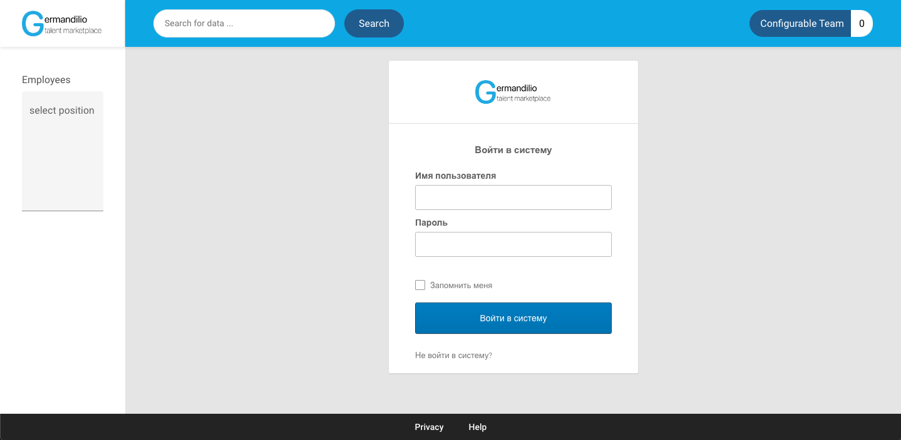
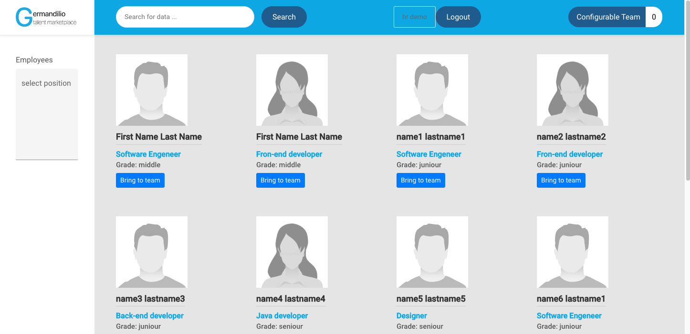
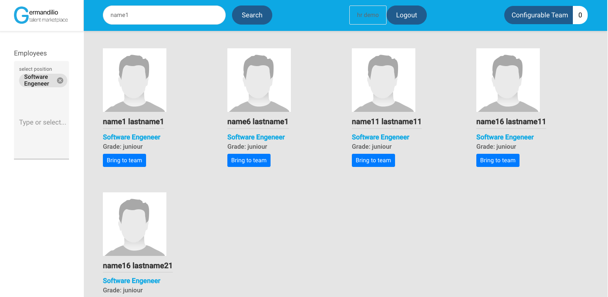
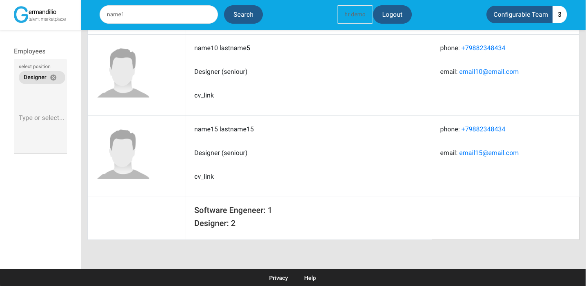

# Internal Talent Marketplace

Project implements [Okta](https://www.okta.com/) security

## Deployment
You can run project using `docker-compose up` in root directory.

## Screenshots

### Fronend configurations
 - [environment](./frontend/internal-talent-marketplace/src/environments/environment.ts)
 - [security(okta)](./frontend/internal-talent-marketplace/src/app/config/security-config.ts)
 
### Backend configurations
 - [properties](./backend/src/main/resources/application.properties)
